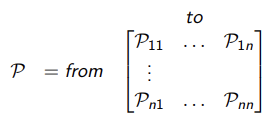

**State Transition Probability:** For a Markov state $s$ and successor state $s'$, the state transition probability is defined by
#### $\mathcal{P}_{ss'} = \mathbb{P} \left[ S_{t+1} = s' \mid S_t = s \right]$

**State Transition Matrix:** defines the STPs from all states $s$ to all successor states $s'$.

where each *row* of the matrix sums to 1.
**Note**: STM is the mathematical representation of a Markov process/Markov chain

##### **Markov Process:** 
Memoryless random process, i.e. a sequence of random states $S_1, S_2, \dots$ with the Markov property.
In the form of a tuple $(S, \mathcal{P})$,
- $S$ is the set of states
- $\mathcal{P}$ is the STP.

##### **Markov Reward Process:**
Markov chain with rewards included
In the form of a tuple $(S, \mathcal{P}, \mathcal{R}, \gamma)$ 
- $S$ is the set of states
- $\mathcal{P}$ is the STP.
- $\mathcal{R}$ is a reward function, $\mathcal{R}_s = \mathbb{E}[R_t+1 | S_t = s]$ 
- $\gamma$ is a discount factor, $\gamma \in [0, 1]$

**Return:** The total discounted reward from a time step t.
##### $G_t = R_{t+1} + \gamma R_{t+2} + \ldots = \sum_{k=0}^{\infty} \gamma^k R_{t+k+1}$ 

**Value Function:** The expected return starting from a state s
##### $v(s) = \mathbb{E}[G_t | S_t = s]$ 

**Note:** Each node in the graph is defined manually at the start, and then iteratively updated with values as the states progress, (similar to how you initialize model weights in deep learning).

**Bellman Equation for MRPs**:
The value function can be decomposed into the immediate reward $R_t+1$ and the discounted value function of the successor $\gamma v(S_t+1)$.
This is done 
- for user clarity? you know how much of the reward is inherent and how much is due to the model's predictions.
- it's just more convenient in a lot of places to separate these 2 quantities. don't read into it too much

#### Markov Decision Process:
Is a Markov Reward Process with decisions.

Represented in the form of a tuple $(S, \mathcal{A}, \mathcal{P}, \mathcal{R}, \gamma)$  
- $S$ is the set of states
- $\mathcal{A}$ is the set of actions
- $\mathcal{P}$ is the STP, $\mathcal{P}^a_{ss'} = \mathbb{P} \left[ S_{t+1} = s' \mid S_t = s, A_t = a\right ]$  
- $\mathcal{R}$ is a reward function, $\mathcal{R}^a_s = \mathbb{E}[R_t+1 | S_t = s, A_t = a]$  
- $\gamma$ is a discount factor, $\gamma \in [0, 1]$

**Policy:** 
A policy is a mapping from state to action, which dictates the behaviour of the agent.
- in simpler networks this can be represented as a matrix of n(states) * n(actions)
- in more complicated networks, you can integrate a neural network that takes in the state as input and outputs a distribution across actions. -> Deep RL
#### $\pi(a \mid s) = \mathbb{P}[A_t = a \mid S_t = s]$ 

**State Value Function:** 
Same deal, is the expected return starting from state s and following policy $\pi$
#### $v_\pi(s) = \mathbb{E}_\pi[G_t \mid S_t = s]$ 

**Action Value Function:**
is the expected return starting from state s, taking action a, and then following policy $\pi$
- Calculated for each action that can be taken 
- Action with the highest AVF is taken
#### $q_\pi(s, a) = \mathbb{E}_\pi[G_t \mid S_t = s, A_t = a]$ 

**Bellman Expectation Equations:**
#### $v_\pi(s) = \mathbb{E}_\pi[R_{t+1} + \gamma v_\pi(S_t+1) \mid S_t = s]$

#### $q_\pi(s) = \mathbb{E}_\pi[R_{t+1} + \gamma v_\pi(S_{t+1}, A_{t+1}) \mid S_t = s, A_t = a]$  

can also be expressed in the form of a matrix
#### $v_\pi = \mathcal{R}^\pi + \gamma \mathcal{P}^\pi v_\pi$ 
#### $v_\pi = (I - \gamma \mathcal{p}^\pi)^{-1} \mathcal{R}^\pi$    
##### **Optimal Value Functions:**
**Optimal SVF:** Maximum state value function over all policies
#### $v_*(s) = \max_\pi v_\pi(s)$

**Optimal AVF:** Maximum state value function over all policies
#### $q_*(s, a) = \max_\pi q_\pi(s, a)$

##### **Optimal Policy:**
##### $\pi \geq \pi' \ \text{if} \ v_{\pi}(\mathbf{s}) \geq v_{\pi'}(\mathbf{s}),\ \forall \mathbf{s}$

For any MDP,
- There exists an optimal policy $\pi_*$ that is better than or equal to all other policies
- All optimal policies achieve the optimal SVF $v_{\pi_*} (s) = v_* (s)$ 
- All optimal policies achieve the optimal AVF $q_{\pi_*} (s, a) = q_* (s, a)$ 

